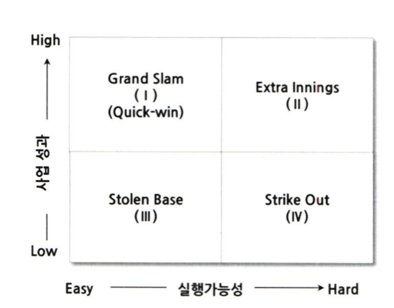
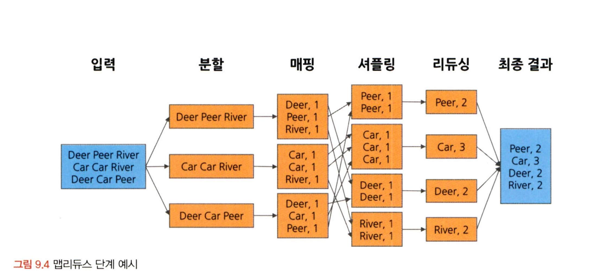
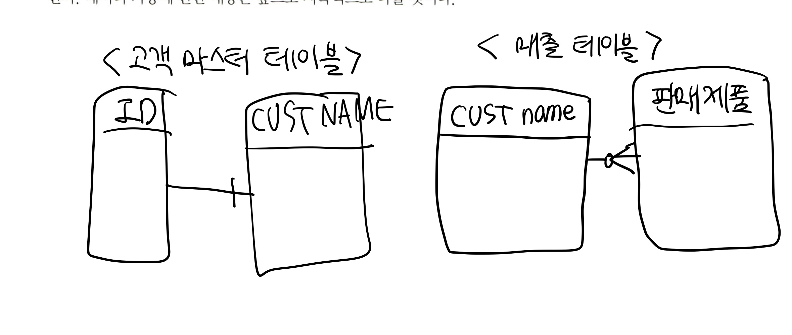

# 통계학 3주차 정규과제

📌통계학 정규과제는 매주 정해진 분량의 『*데이터 분석가가 반드시 알아야 할 모든 것*』 을 읽고 학습하는 것입니다. 이번 주는 아래의 **Statistics_3rd_TIL**에 나열된 분량을 읽고 `학습 목표`에 맞게 공부하시면 됩니다.

아래의 문제를 풀어보며 학습 내용을 점검하세요. 문제를 해결하는 과정에서 개념을 스스로 정리하고, 필요한 경우 추가자료와 교재를 다시 참고하여 보완하는 것이 좋습니다.

3주차는 `2부-데이터 분석 준비하기`를 읽고 새롭게 배운 내용을 정리해주시면 됩니다


## Statistics_3rd_TIL

### 2부. 데이터 분석 준비하기

### 08. 분석 프로젝트 준비 및 기획

### 09. 분석 환경 세팅하기


## Study ScheduleStudy Schedule

| 주차  | 공부 범위     | 완료 여부 |
| ----- | ------------- | --------- |
| 1주차 | 1부 p.2~46    | ✅         |
| 2주차 | 1부 p.47~81   | ✅         |
| 3주차 | 2부 p.82~120  | ✅         |
| 4주차 | 2부 p.121~167 | 🍽️         |
| 5주차 | 2부 p.168~202 | 🍽️         |
| 6주차 | 3부 p.203~250 | 🍽️         |
| 7주차 | 3부 p.251~299 | 🍽️         |

<!-- 여기까진 그대로 둬 주세요-->


# 1️⃣ 개념 정리 

## 08. 분석 프로젝트 준비 및 기획

```
✅ 학습 목표 :
* 데이터 분석 프로세스를 설명할 수 있다.
* 비즈니스 문제를 정의할 때 주의할 점을 설명할 수 있다.
* 외부 데이터를 수집하는 방법에 대해 인식한다.
```
데이터 분석의 목표: 효과적인 결정을 할 수 있도록 도움을 주는 것

**8.1.1.데이터 분석 3단계**


1. 설계단계
- 목표 정의
- 인력 구성: 데이터 관리 활용 실무자 + 데이터 분석가 

2. 분석 및 모델링 단계
- 서버 환경 마련 -> 데이터 분석과 모델링 시행
- 데이터 추출, 검토, 가공, 모델링 
- 모델의 적합성 분석, 성능 평가 중요
- 대표적인 분석 및 모델링 방법론: CRISP-DM, SEMMA 

3. 구축 및 활용 단계
- 최종 선정 분석 모델 적용 및 성과 측정
- IT 시스템 구축 요구
- 모델의 효과 측정 및 평가 -> A/B 테스트


**8.1.2.CRISP-DM** 

*1단계: 비즈니스 이해*
-현재 상황 평가
-데이터 마이닝 목표 결정
-프로젝트 계획 수립

*2단계: 데이터 이해*
-데이터 설명
-데이터 탐색
-데이터 품질 확인

*3단계: 데이터 준비*
-데이터 선택
-데이터 정제
-필수 데이터 구성
-데이터 통합

*4단계: 모델링*
-모델링 기법 선정
-테스트 디자인 생성
-모델 생성
-모델 평가

*5단계: 평가*
-결과 평가
-프로세스 검토
-다음 단계 결정

*6단계: 배포*
-배포 계획
-모니터링 및 유지 관리 계획
-최종 보고서 작성
-프로젝트 검토

**8.1.3 SAS SEMMA방법론**
*sampling단계*
-전체 데이터에서 분석용 데이터 추출
-의미 있는 정보를 추출하기 위한 데이터 분할 및 병합
-표본추출을 통해 대표성을 가진 분석용 데이터 생성
-분석 모델 생성을 위한 학습, 검증, 테스트 데이터셋 붆ㄹ

*exploration단계*
-통계치 확인, 그래프 생성 등을 통해 데이터 탐색
-상관분석, 클러스터링 등을 통해 변수 간의 관계 파악
-분석 모델에 적합한 변수 선정
-데이터 현황을 파악하여 비즈니스 아이디어 도출 및 분석 방향 수정

*modification단계*
-결측값 처리 및 최종 분석 변수 선정
-로그변환, 구간화 등 데이터 가공
-주성분분석 등을 통해 새로운 변수 생성

*modeling단계*
-다양한 데이터마이닝 기법 적용에 대한 적합성 검토
-비즈니스 목적에 맞는 분석 모델을 선정하여 분석 알고리즘 적용
-지도학습, 비지도학습, 강화학습 등 데이터 형태에 따라 알맞은 모델 선정
-분석환경 인프라 성능과 모델 정확도를 고려한 모델 세부 옵션 설정

*assessment단계*
-구축한 모델들의 예측력 등 성능을 비교 분석 평가
-비즈니스 상황에 맞는 적정 임계치 설정
-분석 모델 결과를 비즈니스 인사이트에 적용
-상황에 따라 추가적인 데이터 분석 수행


핵심! 초반부: 문제와 해결 방향 정의, 데이터 탐색
중반부: 목적에 맞도록 데이터 수집 및 가공, 머신러닝 모델 활용
후반부: 분석 결과 검토 검증, 실무 적용 + 모니터링

**8.2 비즈니스 문제 정의와 분석 목적 도출**
비즈니스 문제 정의 접근법 
-> MECE:
세부 정의들을 합했을 때 완전히 전체를 이루는 것
로직트리를 활용해 세부 항목 정리 

비즈니스 문제와 목적 ex) 통신: 약정기간이 끝난 고객들이 타 통신사로 이탈하여 회사의 수익이 감소 -> 현상일 뿐, 본질적인 문제점을 찾아내야함

#1
- 비즈니스 문제: 고객 이탈
- 분석 목적: 고객 이탈 방지 -> 이탈 예상 고객 대상 프로모션 진행 -> 이탈 고객 예측 모델 구축

#2
- 비즈니스 문제: 고객 이탈로 인한 수익 감소
- 분석 목적: 수익 감소 최소화를 위해 고객 이탈 방지 -> 고객 이탈에 따른 손해 최소화 -> 프로모션 최적화 모델 구축


-> 페이오프 매트릭스: 과제의 수익성과 실행 가능성 수준에 따라 4개의 분면에 과제 우선순위를 표현 

최종실행 과제: grand slam에 포함되는 세부과제를 우선 선정
다음 ) extra Innings 중 일부 선정 / stolen base, strike out제외

**8.3 분석 목적의 전환**
분석 프로젝트의 방향 전환 가능
인지했으면 빠르게 빠꾸

분석 프로젝트를 수행하는 동안에는 실무자들 간의 커뮤니케이션 및 협력이 매우매우매우 중요

**8.4 도메인 지식**

: 해당되는 분야의 업에 대한 이해도 

도메인 지식을 효과적으로 습독하는 방법
1. 실무자와의 미팅 -> 질문, 자료요청 부끄러워 nono
2. 논문 참고
3. 현장 방문 후 데이터 생성 과정 직접 참관

**8.5 외부 데이터 수집과 크롤링**

외부데이터를 수집하는 방법
1. 데이터 판매 전문 기업으로 부터 구매 or MOU
2. 공공 오픈 데이터 
3. 웹에 있는 데이터 크롤링

<크롤링(=스크래핑)>
: 웹상을 돌아다니면서 정보를 수집하는 것
크롤링: 주어진 웹 페이지 내에 있는 링크들을 따라가며 모든 내용 가져옴 
스크래핑: 자신이 원하는 부분의 정보만

F12키를 누르고 개발자도구 창을 통해 크롤링 할 수 있음


+)
- 데이터 마이닝: 대량의 데이터에서 유용한 패턴, 규칙, 관계를 찾아내는 과정 

- 지도학습: 입력 데이터와 그에 대응되는 정답이 함께 주어져 모델이 정답을 맞추도록 학습하는 방식
ex) 키와 몸무게 데이터를 보고 비만여부 분류

- 비지도학습: 정답이 없는 데이터, 숨겨진 패턴이나 구조 발견
ex) 쇼핑 고객을 소비 패턴에 따라 군집화

- 강화학습: 보상을 극대화하며 시행착오로 배우기
ex) 자율주행 자동차: 신호 지키기 = 장기적으로 점수를 많이 얻는다 는 전략을 학습하여 신호를 더욱 잘지키는 프로세스를 채택함

- 모델링 = 전통 통계 모델(회귀분석) + 머신러닝 모델(데이터 기반 자동 학습 방식) 


## 09. 분석 환경 세팅하기

```
✅ 학습 목표 :
* 데이터 분석의 전체적인 프로세스를 설명할 수 있다.
* 테이블 조인의 개념과 종류를 이해하고, 각 조인 방식의 차이를 구분하여 설명할 수 있다.
* ERD의 개념과 역할을 이해하고, 기본 구성 요소와 관계 유형을 설명할 수 있다.
```

*9.1 데이터 분석 언어*
<상업용 데이터 분석 솔루션>
SAS, SPSS(대용량 데이터 분석 적합x)

<오픈소스>
R, 파이썬

1. SAS
- 대표적인 제품형 분석 솔루션
- 상용 솔루션 -> 신뢰도 높음
- 프로그래밍 스킬이 부족한 사람도 데이터 분석 가능
- 기업의 데이터 환경에 맞게 커스텀 가능
- 급격한 데이터 분석 환경 변화에 맞게 고급 및 예측 분석 솔루션 제공
- 데이터 시가과 용이
- 딥러닝, 인공신경망 분석 -> R이나 파이션보다는 약함
- 요즘 점유율 감소 -> 자유도가 높고 비용 합리적인 R, 파이썬을 선호

2. R
- 통계적 기능 우수, 데이터 시각화 특화
- 요즘에는 상업용으로도 쓰임
- 활발한 커뮤니티 -> 10만 개 이상의 데이터 분석 패키지 공유
- 오픈소스 -> 잘 작동하지 않는 패키지 존재
- 파이썬에 비해 프로그래밍적 소양 부족해도 사용하는데 문제 x

3. 파이썬
- C언어로 구현된 프로그래밍 언어
- 데이터 분석을 너머 웹서비스, 응용 프로그램, IoT등 다양한 분야
- 사람이 이해하기에 문법이 쉽고 간단 but 느리다
- 데이터 분석, 데이터 마이닝 파이썬 유용 but 영상처리, 딥러닝(복잡한 연산) -> C언어 활용 
- 대표적 기계학습 도구 : sklearn(사이킷런), TensorFlow(텐서플로), Pandas(판다스), NumPy(넘파이), matplotlib(맷플롯립) 

4. SQL
- 데이터 베이스 시스템에서 데이터를 관리 및 처리하기 위해 설계된 언어
- 데이터 분석가로서 필수적
- 명령문이 짧고 간결


*9.2 데이터 처리 프로세스 이해하기*

OLTP -> DW(:DATA WAREHOUSE, ODS) -> DM -> OLAP
1. OLTP
- OnLine Transaction Processing
- 실시간으로 데이터를 트랜잭션 단위로 수집 분류 저장하는 시스템
- ex) 수많은 입출금이 일어나는 은행에서 기록을 오류없이 실시간으로 처리하고 저장하는 시스템
- 데이터 생성 저장 처음 단계

2. DW(Data Warehouse)
- 창고
- 수집된 데이터를 사용자 관점에서 주제별로 통합, 원하는 데이터 뺴낼 수 있도록
- 산재된 데이터를 한 곳에 취합
- DW -> OLTP 보호, 데이터 활용 효율 상승
- ODS: 최신데이터 반영 목적, DW에 저장하기 전 임시 데이터 보관소

3. DM(Data Mart)
- 사용자의 목적에 맞도록 가공된 일부 데이터 저장되는 곳
- 부서별 개별 데이터 저장소 = DM 
- 접근성, 데이터 분석 효율성을 높임 


<데이터 처리 프로세스 : ETL>
    - 추출(Extract): 원천 소스 데이터 베이스로부터 필요한 데이터를 읽어 들이는 과정
    - 변환(Transform): 미변환 상태의 raw 데이터를 정리, 필터링, 정형화, 요약, 분석에 적합한 상태로 바꾸어 놓는 과정 
    - 불러내기(Load): 변환된 데이터를 새로운 테이블(목표 시스템)에 적재하는 과정
: 저장된 데이터를 사용자가 요구하는 포맷으로 변형하여 이동시키는 작업 과정

ex) extract: 연도 월 일 칼럼 데이터 추출
transform: 7월 7일 -> 0707로 변환
load: 새로 만든 칼럼을 원하는 테이블에 적재

*9.3 분산데이터 처리*
분산 데이터 처리: 한 컴퓨터가 처리해야할 일을 여러 컴퓨터가 나눠서 한 다음 그 결과를 합치는 것
- scale-up: 빅데이터 처리를 위해 하나의 컴퓨터의 용량을 늘리고 더 빠른 프로세서 탑재
    -> 데이터 크기 커지면 속도가 급격히 느려짐
- scale-out: 분산데이터 처리처럼 여러 대의 컴퓨터를 병렬적으로 연결하는 것 
    -> 효율 높음


*9.3.1 HDFS*
연결된 컴퓨터들이 효율적으로 데이터를 나눠서 처리하고 결과를 취합하는 기술
- 하둡의 HDFS: 슬레이브 노드 / 마스터 노드 / 클라이언트 머신
    - 슬레이브 노드 : 데이터 저장, 계산 
    - 마스터 노드 : 대량의 데이터를 HDFS에 저장, 맵리듀스 방식으로 데이터 병렬 처리
    - 클라이언트 머신: 맵리듀스 작업을 통해 산출된 결과를 사용자에게 보여줌 

- 맵리듀스: 맵 / 리듀스
    - 맵: 흩어져 있는 데이터를 관련된 데이터끼리 묶어서 임시의 집합을 만드는 과정
    - 리듀스: 필터링, 정렬 -> 
    - key value 쌍으로 데이터 처리 
    ex) 자동차 key car 맥주 key beer -> value 
    - 정렬, 병합 등의 과정으로 리듀스 단계에서 나눠져 있던 결과들 취합하여 최종 결과 생성 
    - 4단계: 분할 / 매핑/ 셔플링/ 리듀싱



- 하둡
    - HDFS, 맵리듀스, YARN(리소스 관리자)
    
- 하둡 YARN
    - 리소스 매너저 / 애플리케이션 마스터 / 타임라인 서버 
    - 리소스 관리, 스케줄링, 모니터링 기능 제공

- 분산 시스템 구조
1. 노드: 하나의 컴퓨터
2. 랙: 몇 개의 컴퓨터가 모인 것
3. 클러스터: 랙들이 모인 것 
맵, 리듀스를 통해 분산처리

*9.3.2 아파치 스파크*
HDFS와 스파크
    스파크: HDFS 과정 중 분산 데이터 처리를 하는 하나의 시스템
    데이터가 메모리에 저장, 재사용 가능

스파크 특징
1. 인메모리 기반: 빠른 데이터 처리 가능
2. 다양한 언어 지원
3. 일괄 처리 기능
4. 실시간 데이터 처리
5. 다양한 머신러닝 알고리즘 + 시각화 알고리즘  -> 단일 프레임워크로 통합
6. 온라인 분석 처리(OLAP) 작업에 특화

제플린
- 시각화 툴
- 파이썬 언어로 데이터 가공, 모델링 가능

*9.4 테이블 조인과 그리고 ERD*

*9.4.1 테이블 조인*
1. 레프트 조인과 라이트 조인
레프트, 라이트 -> 결합에 기준이 되는 테이블

일치하는 키 값이 없는 행은 조인하는 테이블의 값이 결측값으로 나타남
관측치가 여러 개 -> 행 늘어남
ex) 부서 정보 테이블 인사 팀 행 2개 -> 두 줄씩 생성

2. 이너 조인과 풀조인
이너조인: 두 테이블 간에 겹치는 부분의 행만 가져오기 
풀조인: 모든 행을 살리는 방법

3. 크로스 조인
ex) 구매 예측 대상 차량 5개-> 고객별 5개 차량에 대한 모든 독립변수와 종속변수 행을 만듦

*9.4.2 데이터 단어 사전*

데이터 단어사전: 각 칼럼과 테이블의 이름을 정할 때 체계를 약속한 일종의 사전
메타데이터 관리 시스템: 데이터가 어디에 저장, 데이터를 어떻게 사용할 것인지 이해할 수 있도록 데이터 정보 관리 시스템
메타데이터: 각 테이블과 거기에 포함된 데이터의 속성에 관한 정보, 데이터들 간의 관계 정의

*9.4.3 테이블 정의서*
메타데이터 관리시스템을 간소화한 버전
테이블정의서: DW, DM등 적재된 테이블과 칼럼의 한글, 영문명, 데이터 속성, 간단한 설명 정리 

*9.4.4 ERD*
각 테이블의 구성 정보와 테이블 간 관계를 도식으로 표현한 그림 형태 

1. 물리: DB를 효율적이고 결점 없이 구현하는 것을 목표
2. 논리: 데이터 사용자 입장에서 테이블 간 매핑에 오류가 없으며 데이터 정규화가 이루어짐

ERD의 핵심: 키 칼럼(ID)과 연결관계를 의미하는 식별자 -> 기본 키 / 외래 키
1. 기본키: 해당 테이블에서 유일하게 구분되는 칼럼(중복x, 결측값x)
2. 외래키: 다른 테이블과 연결(중복, 결측값 가능)

테이블 간 연결관계는 여러 경우의 수가 있음 
ex) 고객 마스터 테이블 -> 모든 고객이 하나의 행씩 존재
매출 테이블 -> 동일한 고객이 아예 존재x or 여러 행씩 존재 




<br>
<br>

---

# 2️⃣ 확인 문제

## 문제 1.

> **🧚 아래의 테이블을 조인한 결과를 출력하였습니다. 어떤 조인 방식을 사용했는지 맞춰보세요.**

> 사용한 테이블은 다음과 같습니다.

| **emp_cd** | **emp_nm** | **job** | **dep_cd** |
| ---------- | ---------- | ------- | ---------- |
| 1001       | 김권택     | 부장    | 30         |
| 1002       | 김미정     | 과장    | 20         |
| 1003       | 이지민     | 대리    | 20         |
| 1004       | 장동혁     | 사원    | 10         |
| 1005       | 이승화     | 사원    | 30         |
| 1006       | 곽주영     | 과장    | 40         |
| 1007       | 조용호     | 사장    | NULL       |
| 1008       | 가나다     | 대리    | 40         |
| 1009       | 홍길동     | 차장    | 10         |

| **dep_cd** | **dep_nm** | **location** |
| ---------- | ---------- | ------------ |
| 10         | 인사팀     | 서울         |
| 20         | 경리팀     | 서울         |
| 30         | 영업팀     | 과천         |
| 40         | 전산팀     | 대전         |
| 50         | 법무팀     | 인천         |

> 보기: INNER, LEFT, RIGHT 조인

<!-- 테이블 조인의 종류를 이해하였는지 확인하기 위한 문제입니다. 각 테이블이 어떤 조인 방식을 이용하였을지 고민해보고 각 테이블 아래에 답을 작성해주세요.-->

### 1-1. 

| **emp_cd** | **emp_nm** | **job** | **dep_cd** | **dep_nm** | **location** |
| ---------- | ---------- | ------- | ---------- | ---------- | ------------ |
| 1001       | 김권택     | 부장    | 30         | 영업팀     | 과천         |
| 1002       | 김미정     | 과장    | 20         | 경리팀     | 서울         |
| 1003       | 이지민     | 대리    | 20         | 경리팀     | 서울         |
| 1004       | 장동혁     | 사원    | 10         | 인사팀     | 서울         |
| 1005       | 이승화     | 사원    | 30         | 영업팀     | 과천         |
| 1006       | 곽주영     | 과장    | 40         | 전산팀     | 대전         |
| 1007       | 김태연     | 사장    |            |            |              |
| 1008       | 최철원     | 대리    | 40         | 전산팀     | 대전         |
| 1009       | 노동희     | 차장    | 10         | 인사팀     | 서울         |

```
여기에 답을 작성해주세요!
```


### 1-2. 

| **emp_cd** | **emp_nm** | **job** | **dep_cd** | **dep_nm** | **location** |
| ---------- | ---------- | ------- | ---------- | ---------- | ------------ |
| 1001       | 김권택     | 부장    | 30         | 영업팀     | 과천         |
| 1002       | 김미정     | 과장    | 20         | 경리팀     | 서울         |
| 1003       | 이지민     | 대리    | 20         | 경리팀     | 서울         |
| 1004       | 장동혁     | 사원    | 10         | 인사팀     | 서울         |
| 1005       | 이승화     | 사원    | 30         | 영업팀     | 과천         |
| 1006       | 곽주영     | 과장    | 40         | 전산팀     | 대전         |
| 1008       | 최철원     | 대리    | 40         | 전산팀     | 대전         |
| 1009       | 노동희     | 차장    | 10         | 인사팀     | 서울         |

```
여기에 답을 작성해주세요!
```


### 1-3. 

| **emp_cd** | **emp_nm** | **job** | **dep_cd** | **dep_nm** | **location** |
| ---------- | ---------- | ------- | ---------- | ---------- | ------------ |
| 1004       | 장동혁     | 사원    | 10         | 인사팀     | 서울         |
| 1009       | 홍길동     | 차장    | 10         | 인사팀     | 서울         |
| 1002       | 김미정     | 과장    | 20         | 경리팀     | 서울         |
| 1003       | 이지민     | 대리    | 20         | 경리팀     | 서울         |
| 1001       | 김권택     | 부장    | 30         | 영업팀     | 과천         |
| 1005       | 이승화     | 사원    | 30         | 영업팀     | 과천         |
| 1006       | 곽주영     | 과장    | 40         | 전산팀     | 대전         |
| 1008       | 최철원     | 대리    | 40         | 전산팀     | 대전         |
|            |            |         | 50         | 법무팀     | 인천         |

```
여기에 답을 작성해주세요!
```


### 🎉 수고하셨습니다.