# 통계학 4주차 정규과제

📌통계학 정규과제는 매주 정해진 분량의 『*데이터 분석가가 반드시 알아야 할 모든 것*』 을 읽고 학습하는 것입니다. 이번 주는 아래의 **Statistics_4th_TIL**에 나열된 분량을 읽고 `학습 목표`에 맞게 공부하시면 됩니다.

아래의 문제를 풀어보며 학습 내용을 점검하세요. 문제를 해결하는 과정에서 개념을 스스로 정리하고, 필요한 경우 추가자료와 교재를 다시 참고하여 보완하는 것이 좋습니다.

4주차는 `2부-데이터 분석 준비하기`를 읽고 새롭게 배운 내용을 정리해주시면 됩니다


## Statistics_4th_TIL

### 2부. 데이터 분석 준비하기

### 10. 데이터 탐색과 시각화

<!-- 10. 데이터 탐색과 시각화에서 10.1 탐색적 데이터 분석부터 10.4 비교 시각화 파트까지 진행해주시면 됩니다. -->


**(수행 인증샷은 필수입니다.)** 

<!-- 이번주는 확인 문제가 없고, 교재의 실습에 있는 부분을 따라해주시면 됩니다. 데이터셋과 참고자료는 노션의 정규과제란에 있는 깃허브를 활용해주시면 됩니다. -->


## Study ScheduleStudy Schedule

| 주차  | 공부 범위     | 완료 여부 |
| ----- | ------------- | --------- |
| 1주차 | 1부 p.2~46    | ✅         |
| 2주차 | 1부 p.47~81   | ✅         |
| 3주차 | 2부 p.82~120  | ✅         |
| 4주차 | 2부 p.121~167 | ✅         |
| 5주차 | 2부 p.168~202 | 🍽️         |
| 6주차 | 3부 p.203~250 | 🍽️         |
| 7주차 | 3부 p.251~299 | 🍽️         |

<!-- 여기까진 그대로 둬 주세요-->


---

# 1️⃣ 개념 정리 

## 10. 데이터 탐색과 시각화

```
✅ 학습 목표 :
* EDA의 목적을 설명할 수 있다.
* 주어진 데이터셋에서 이상치, 누락값, 분포 등을 식별하고 EDA 결과를 바탕으로 데이터셋의 특징을 해석할 수 있다.
* 공분산과 상관계수를 활용하여 두 변수 간의 관계를 해석할 수 있다.
* 적절한 시각화 기법을 선택하여 데이터의 특성을 효과적으로 전달할 수 있다.
```


ML모델 성능: 알고리즘 우수성 , 파라미터 최적화 << 데이터 올바르게 파악, 효과적으로 가공

GIGO: 가치없는 잘못된 데이터를 사용하면 역시 무가치한 결과가 나온다

**EDA와 데이터 시각화 구별**

EDA: 데이터 파악을 효율적으로 시각화
데이터 시각화: 분석 결과를 커뮤니케이션 하기 위함


## 10.1 탐색적 데이터 분석(EDA)

EDA: 가공하지 않은 원천의 데이터를 있는 그대로 탐색, 분석하는 기법

!!지난친 추론, 자의적 해석 지양

[EDA의 주요 목적]
- 데이터의 형태, 척도가 분석에 알맞게 되어있는지
- 데이터의 평균, 분산, 분포, 패턴 등의 확인 -> 데이터 특성 파악
- 데이터의 결측값, 이상치 파악 및 보완
- 변수 간의 관계성 파악
- 분석 목적, 방향성 점검 및 보정

### 10.1.2.탐색적 데이터 분석 실습

- pandas: 데이터 전처리
- seaborn, matplotlib: 시각화 패키지
- .head()
- .info(): 데이터에 대한 전반적인 정보
- .describe(): 평균, 표준편차, 최대 최솟값 확인
    - date처럼 숫자지만 문자형과 다름 없는 칼럼은 의미x
- .skew():
    - 왜도: 데이터 분포의 좌우 비대칭도 (좌우대칭일수록 왜도값 작음)
    - 정규성이 필요한 경우 -> 로그변환, 정규화 등
    - 문자형 변수가 있을 때는 출력오류 -> 숫자형 변수만 담은 집단을 하나 생성해야함 
- .kurtosis() 
    - 첨도: 분포가 정규분포보다 얼마나 뾰족하거나 완만한지 (정규분포보다 뾰족-> 양의 첨도)
    - pandas에서는 kurt()를 씀
    - kurtosis()는 scipy라이브러리 함수 
- sns.distplot(df["변수"])
    - 칼럼의 분포를 시각화 
    - 0의 값이 많은 것이 결측치도 0으로 표기한 것인지 확인 필요
- sns.violinplot
- sns.stripplot
    - inner: 바이올린 안에 추가로 뭘 그릴까?
    - 바이올린 플롯: 분포를 효과적으로 표현
    - 스트립플롯: 각 관측치의 위치를 직관적으로 표현


## 10.2 공분산과 상관성 분석

타깃변수Y와 입력변수X와의 관계, 입력변수X들 간의 관계 확인

### 10.2.1 공분산

상관계수와의 공통점: 각 변수의 변동이 얼마나 닮았는지 표현

공분산: 서로 공유하는 분산, 두 분산의 관계
분산: 한 변수의 각각의 데이터가 퍼진 정도

공분산=0 두 변수 상관관계0
공분산>0 양의 상관관계
공분산<0 음의 상관관계


???분산 - 공분산 관계
분산: 한 변수의 값이 평균에서 얼마나 퍼져 있는가 (한 변수의 흩어짐 정도)
공분산: 두 변수가 함께 변화하는 정도 (두 변수의 방향성 일치 정도)

두 변수의 분산이 비슷하다 
= 흩어짐의 정도가 비슷하다 
!= 함께 움직인다 

ex) 웹사이트 접속시간, 구매비용 공분산

각 웹사이트 접속시간 편차 * 각 고객의 구매비용 편차 / n-1 = 공분산

### 10.2.2 상관계수

- 공분산의 한계:
    - 각 변수 간의 다른 척도기준이 그대로 반영
    - 공분산 값이 지니는 크기가 상관성의 정도 표현x

- 공분산 정규화: 변수 각각의 표준편차 값으로 나눔

- 피어슨 상관계수


    - 절댓값 > 0.7이상 : 상관관계 매우 높음
    - 상관관계에 따른 해석표

    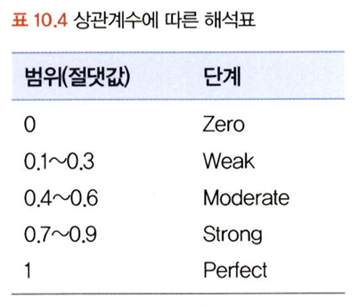

    - 데이터 분포에 따른 상관관계 예시

    
    - **산점도의 기울기 || 상관계수**

    

- 결정계수: 상관계수^2
    - 총 변동 중에서 회귀선에 의해 설명되는 변동이 차지하는 비율
    - 해당 독립변수가 종속변수의 변동을 설명하는 정도
    - = R^2
    - 회귀분석의 정확도를 가늠하는 중요한 기준 값

- 상관분석의 한계
    - 2차 방정식 그래프와 비슷한 모양일 경우 상관계수 매우 ↓
    - 따라서 시각화와 함께 확인

[상관분석표 ]
    
      

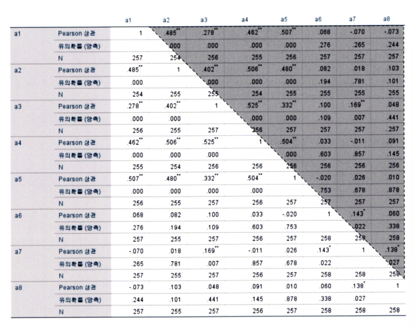

- pearson상관
- 유의확률(양측)
- N: 표본 수


### 10.2.3 공분산과 상관성 분석 실습

*kaggle 와인-품질 데이터셋 활용

- sns.set(font_scale=1.1)
    : 폰트 크기 설정
- sns.set_style('ticks')
    : 축 눈금 설정
- sns.pairplot(df,
             diag_kind='kde'
                )
    - 상관계수가 1이면 분포로 표시
    - 동일한 변수의 산점도를 분포로 표현해주는 기능 

- .cov()
    - numeric_df=df.select_dtypes(include=["number"])
    - 위 코드를 추가해서 숫자형 변수들만 공분산을 계산하도록함 
    - 각 변수 간의 다른 척도기준이 그대로 반영 -> 직관적으로 상관성 파악x 
-.corr()
    - (method='pearson') 기본값이 피어슨이 아닐 경우 추가해줌
- sns.heatmeap()
    - 한눈에 상관관계를 파악 가능
    - but 정확한 수치x
- sns.cmap()
    - 히트맵 + 상관계수
    - 히트맴에서 상관성이 강한 변수들끼리 묶어서 표현 

[중복제거 히트맵]
```np.triu(np.ones_like(numeric_df.corr()))

mask = np.triu(np.ones_like(numeric_df.corr(),dtype=np.bool))

fig,ax=plt.subplots(figsize=(11,9))
sns.heatmap(numeric_df.corr(),
               annot=True,
               cmap="viridis",
               vmin=-1,vmax=1,
               mask=mask)
```

## 10.3 시간 시각화

#### 선그래프
- 시간 간격의 밀도가 높을 때 
- ex) 초 단위의 공정 센서, 일년 간의 일별 판매량 
- 데이터 양 多 , 변동 심하면) 패턴 파악 어려움 -> 추세선 삽입 
- 추세선 : 이동평균 방법 사용
- ex) 2 -> 5 -> 3 -> 7 -> 4
    (2 5 3의 평균) -> (5 3 7의 평균) -> (3 7 4의 평균)

    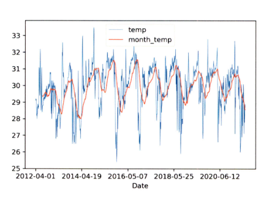

#### (누적) 막대 그래프
- 분절형 시간 시각화 
- ex) 1년 동안의 월 간격 단위의 흐름 
- 누적 막대그래프: 한 시점에 2개 이상의 세부 항목 有
- ex) a,b,c 품목의 월별 판매량 데이터 

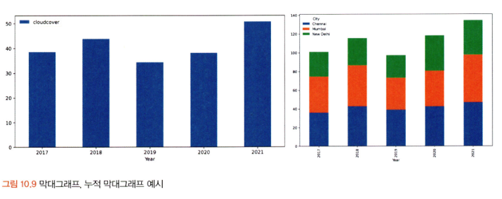

### 10.3.1 시간 시각화 학습

#### 일자별 매출액 데이터 가공
```df['Date2']=pd.to_datetime(df['Order Date'], dayfirst=True) # date 칼럼 날짜 형식 변환

df = df.sort_values(by='Date2') # 날짜 오름차순 정렬

df['Year'] = df['Date2'].dt.year # 연도 칼럼 생성

df_line=df[df.Year==2018] #2018년 데이터만 생성
df_line=df_line.groupby('Date2')['Sales'].sum().reset_index()
df_line.head()
```
#### 선그래프 시각화

```
# 30일 이동평균 생성
df_line['Month'] = df_line['Sales'].rolling(window=30).mean()

# 선그래프 시각화
ax = df_line.plot(x='Date2', y='Sales', linewidth="0.5")
df_line.plot(x='Date2', y='Month', color='#FF7F50', linewidth="1", ax=ax)

```
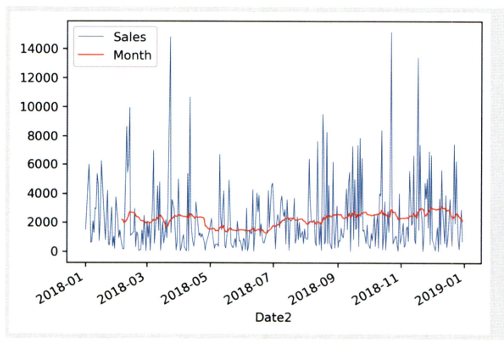


- rolling() : month 칼럼 새로 생성 
- plot() : 선그래프 생성
- 매출액의 편차가 큼 -> 이동평균선 도움

#### 막대그래프 시각화를 위한 데이터 가공 

```
df_bar_1 = df.groupby('Year')['Sales'].sum().reset_index()

df_bar_1.head()
ax = df_bar_1.plot.bar(x='Year', y='Sales',rot=0)
```

- groupby(): 연도별 매출액 합계 
- rot: 글자의 각도

### 10.4 비교 시각화

- 히트맵 차트
    - 그룹과 비교 요소가 많을 때 효과적으로 시각화 가능
    - 행: 그룹 / 열: 요소
    - 행 A변수, 열 B변수, 색상 C 변수

#### 히트맵 차트의 표현 방법
1. 하나의 변수(그룹) X N개의 각 변수에 해당하는 값들(수치형)

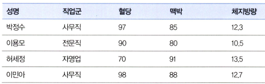 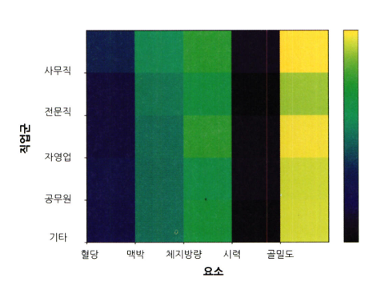

2. 하나의 변수(그룹) X 하나의 변수(수준)

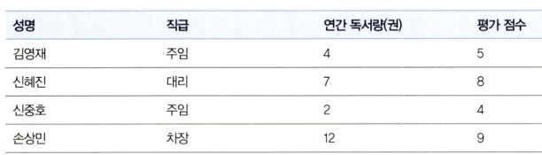 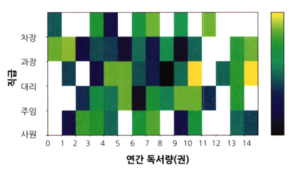


유의할 점: 목적을 정확히 파악, 데이터 정제 작업 요구


#### 방사형 차트

1. 하나의 차트에 하나의 그룹을 시각화

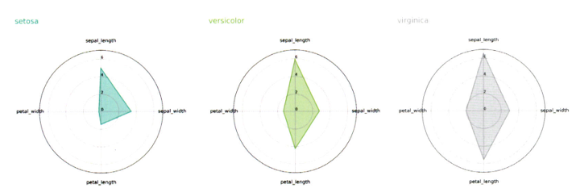

2. 하나의 차트에 모든 그룹을 한 번에 시각화


#### 평행 좌표 그래프

= 전략 캔버스

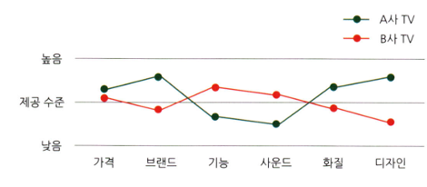

- 변수별 값 -> 정규화 ; 평행 좌표 그래프 효과적으로 표현가능

### 10.4.1 비교 시각화 실습

#### 히트맵 시각화를 위한 데이터 전처리

```
df1 = df[df['Tm'].isin(['ATL','BOS','BRK','CHI','CHO'])]

# 6개 칼럼만 필터링
df1 = df1[['Tm', 'ORB%', 'TRB%', 'AST%', 'BLK%', 'USG%']]

# 팀별 요소 평균 전처리
df1 = df1.groupby('Tm').mean()
```

- 5개의 팀만 필터링
- 5개의 칼럼만 선택
- 팀 단위로 평균을 구한다 

#### 팀별 5개 요소 히트맵 시각화

```
fig = plt,figure(figsize=(8,8))
fig.set_faceolor('White')
plt.pcolor(df1.values)

plt.xticks(range(len(df1.coloumns)),df1.coloumns)
plt.yticks(range(len(df1.index)),df1.index)

plt.xlabel('Value', fontsize=14)
plt.ylabel('Team', fontsize=14)
plt.colorbar()
plt.show()
```

#### 하나의 변수값에 대한 히트맵 시각화를 위한 데이터 전처리
```
df2 = df[df['Tm'].isin(['ATL','BOS','BRK','CHI','CHO'])]# 5개 팀만 필터링/ 

df2 = df2[['Tm','Age','G']]

df2 = df2.groupby(['Tm','Age']).mean().reset_index()

df2 = df2.pivot(index='Tm', columns='Age', values='G')
df2.head()

```

- 각 팀에서 선수들의 연령에 따라 경기 참여 횟수를 히트맵으로 시각화하기 위한 전처리 
- isin: 해당 값이 특정 리스트에 포함되어있는지

#### 하나의 변숫값에 대한 히트맵 시각화

```
fig = plt.figure(figsize=(8,8))
fig.set_facecolor('white')

plt.pcolor(df2.values)

plt.xticks(range(len(df2.coloumns)),df2.columns)

plt.yticks(range(len(df2.coloumns)),df2.index)

plt.xlabel('Age', fontsize=14)

plt.ylabel('Team', font=14)
plt.colorbar()
plt.show()

```

- 흰색공간은 NULL

#### 방사혛 차트 시각화를 위한 데이터 전처리
```
df3 = df1.reset_index()

```
- df1의 기존 인덱스를 일반 열로 바꾸고 새로운 기본 정수 엔덱스를 다시 만듦
- pandas의 dataframe은 행 번호 역할을 하는 인덱스를 가짐 
- groupby, pivot같은 작업을 하면 일부 열이 인덱스로 설정
- reset_index()를 쓰면 일반 열로 리셋됨

#### 방사형 차트 시각화-하나의 차트에 하나의 그룹씩

```
# 방사형 차트 - 하나씩 시각화

labels = df3.columns[1:]
num_labels = len(labels)

# 등분점 생성
angles = [x/float(num_labels)*(2*pi) for x in range(num_labels)]
angles += angles[:1]  # 시작점 생성

my_palette = plt.cm.get_cmap("Set2", len(df3.index))

fig = plt.figure(figsize=(15,20))
fig.set_facecolor('white')

for i, row in df3.iterrows():
    color = my_palette(i)
    data = df3.iloc[i].drop('Tm').tolist()
    data += data[:1]

    ax = plt.subplot(3,2,i+1, polar=True)

    # 시작점 설정
    ax.set_theta_offset(pi / 2)
    # 시계방향 설정
    ax.set_theta_direction(-1)

    plt.xticks(angles[:-1], labels, fontsize=13)
    # 각 축과 눈금 사이 여백 생성
    ax.tick_params(axis='x', which='major', pad=15)
    # 반지름 축 눈금 라벨 각도 0으로 설정
    ax.set_rlabel_position(0)
    # 반지름 축 눈금 설정
    plt.yticks([0,5,10,15,20], ['0','5','10','15','20'], fontsize=10)
    plt.ylim(0,20)

    # 방사형 차트 출력
    ax.plot(angles, data, color=color, linewidth=2, linestyle='solid')
    # 도형 안쪽 색상 설정
    ax.fill(angles, data, color=color, alpha=0.4)
    # 각 차트의 제목 생성
    ax.title(row.Tm, size=20, color=color, x=-0.2, y=1.2, ha='left')

# 차트 간 간격 설정
plt.tight_layout(pad=3)
plt.show()

```
- for 문을 사용하여 각각의 그래프를 만들도록함

#### 방사형 차트 시각화-하나의 차트에 모든 그룹
```
# 방사형 차트 - 한 번에 시각화

labels = df3.columns[1:]
num_labels = len(labels)

# 등분점 생성
angles = [x/float(num_labels)*(2*pi) for x in range(num_labels)]
# 시작점 생성
angles += angles[:1]

my_palette = plt.cm.get_cmap("Set2", len(df3.index))

fig = plt.figure(figsize=(8,8))
fig.set_facecolor('white')
ax = fig.add_subplot(polar=True)

for i, row in df3.iterrows():
    color = my_palette(i)
    data = df3.iloc[i].drop('Tm').tolist()
    data += data[:1]

    # 시작점 설정
    ax.set_theta_offset(pi / 2)
    # 시계방향 설정
    ax.set_theta_direction(-1)

    # 각도 축 눈금 생성
    plt.xticks(angles[:-1], labels, fontsize=13)
    # 각 축과 눈금 사이 여백 생성
    ax.tick_params(axis='x', which='major', pad=15)
    # 반지름 축 눈금 라벨 각도 0으로 설정
    ax.set_rlabel_position(0)
    # 반지름 축 눈금 설정
    plt.yticks([0,5,10,15,20], ['0','5','10','15','20'], fontsize=10)
    plt.ylim(0,20)

    # 방사형 차트 출력
    ax.plot(angles, data, color=color, linewidth=2, linestyle='solid', label=row.Tm)
    # 도형 안쪽 색상 설정
    ax.fill(angles, data, color=color, alpha=0.4)

plt.legend(loc=(0.9,0.9))
plt.show()

```

- 그룹이 많지 않은 경우에 위와 같이 비교하는 것이 더 좋음


#### 평행 좌표 그래프 시각화

```
fig,axes=plt.subplot()
plt.figure(figsize=(16,8))
parallel_coordinates(df3,'Tm',ax=axes,colormap='winter',Linewidth="0.5")

```

- 방사형 차트를 길게 표현한 것

<br>
<br>

---

# 2️⃣ 확인 과제

> **교재에 있는 실습 파트를 직접 따라 해보세요. 실습을 완료한 뒤, 결과화면(캡처 또는 코드 결과)을 첨부하여 인증해 주세요.단순 이론 암기보다, 직접 손으로 따라해보면서 실습해 보는 것이 가장 확실한 학습 방법입니다.**
>
> > **인증 예시 : 통계 프로그램 결과, 시각화 이미지 캡처 등**


https://colab.research.google.com/drive/1rARBlayzwf5liR6jVdpYiTvo0WvHIv0z#scrollTo=fqQeodW0i6dZ

~~~
인증 이미지가 없으면 과제 수행으로 인정되지 않습니다.
~~~


### 🎉 수고하셨습니다.