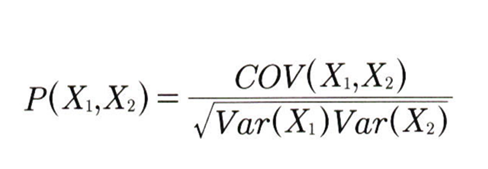
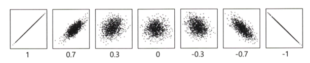
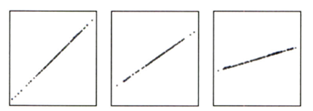
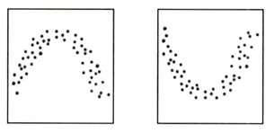
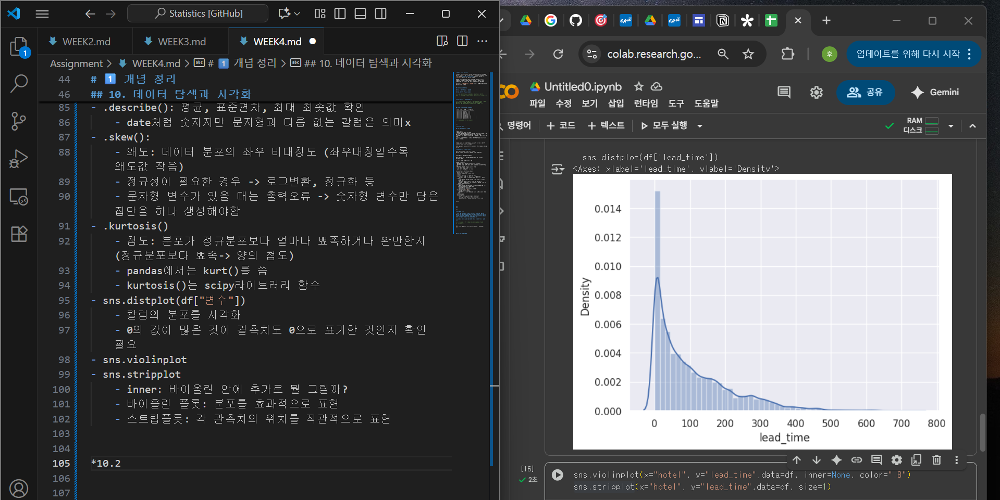

# 통계학 4주차 정규과제

📌통계학 정규과제는 매주 정해진 분량의 『*데이터 분석가가 반드시 알아야 할 모든 것*』 을 읽고 학습하는 것입니다. 이번 주는 아래의 **Statistics_4th_TIL**에 나열된 분량을 읽고 `학습 목표`에 맞게 공부하시면 됩니다.

아래의 문제를 풀어보며 학습 내용을 점검하세요. 문제를 해결하는 과정에서 개념을 스스로 정리하고, 필요한 경우 추가자료와 교재를 다시 참고하여 보완하는 것이 좋습니다.

4주차는 `2부-데이터 분석 준비하기`를 읽고 새롭게 배운 내용을 정리해주시면 됩니다


## Statistics_4th_TIL

### 2부. 데이터 분석 준비하기

### 10. 데이터 탐색과 시각화

<!-- 10. 데이터 탐색과 시각화에서 10.1 탐색적 데이터 분석부터 10.4 비교 시각화 파트까지 진행해주시면 됩니다. -->


**(수행 인증샷은 필수입니다.)** 

<!-- 이번주는 확인 문제가 없고, 교재의 실습에 있는 부분을 따라해주시면 됩니다. 데이터셋과 참고자료는 노션의 정규과제란에 있는 깃허브를 활용해주시면 됩니다. -->


## Study ScheduleStudy Schedule

| 주차  | 공부 범위     | 완료 여부 |
| ----- | ------------- | --------- |
| 1주차 | 1부 p.2~46    | ✅         |
| 2주차 | 1부 p.47~81   | ✅         |
| 3주차 | 2부 p.82~120  | ✅         |
| 4주차 | 2부 p.121~167 | ✅         |
| 5주차 | 2부 p.168~202 | 🍽️         |
| 6주차 | 3부 p.203~250 | 🍽️         |
| 7주차 | 3부 p.251~299 | 🍽️         |

<!-- 여기까진 그대로 둬 주세요-->


---

# 1️⃣ 개념 정리 

## 10. 데이터 탐색과 시각화

```
✅ 학습 목표 :
* EDA의 목적을 설명할 수 있다.
* 주어진 데이터셋에서 이상치, 누락값, 분포 등을 식별하고 EDA 결과를 바탕으로 데이터셋의 특징을 해석할 수 있다.
* 공분산과 상관계수를 활용하여 두 변수 간의 관계를 해석할 수 있다.
* 적절한 시각화 기법을 선택하여 데이터의 특성을 효과적으로 전달할 수 있다.
```


ML모델 성능: 알고리즘 우수성 , 파라미터 최적화 << 데이터 올바르게 파악, 효과적으로 가공

GIGO: 가치없는 잘못된 데이터를 사용하면 역시 무가치한 결과가 나온다

**EDA와 데이터 시각화 구별**

EDA: 데이터 파악을 효율적으로 시각화
데이터 시각화: 분석 결과를 커뮤니케이션 하기 위함


*10.1 탐색적 데이터 분석(EDA)*

EDA: 가공하지 않은 원천의 데이터를 있는 그대로 탐색, 분석하는 기법

!!지난친 추론, 자의적 해석 지양

[EDA의 주요 목적]
- 데이터의 형태, 척도가 분석에 알맞게 되어있는지
- 데이터의 평균, 분산, 분포, 패턴 등의 확인 -> 데이터 특성 파악
- 데이터의 결측값, 이상치 파악 및 보완
- 변수 간의 관계성 파악
- 분석 목적, 방향성 점검 및 보정

*10.1.2.탐색적 데이터 분석 실습*
- pandas: 데이터 전처리
- seaborn, matplotlib: 시각화 패키지
- .head()
- .info(): 데이터에 대한 전반적인 정보
- .describe(): 평균, 표준편차, 최대 최솟값 확인
    - date처럼 숫자지만 문자형과 다름 없는 칼럼은 의미x
- .skew():
    - 왜도: 데이터 분포의 좌우 비대칭도 (좌우대칭일수록 왜도값 작음)
    - 정규성이 필요한 경우 -> 로그변환, 정규화 등
    - 문자형 변수가 있을 때는 출력오류 -> 숫자형 변수만 담은 집단을 하나 생성해야함 
- .kurtosis() 
    - 첨도: 분포가 정규분포보다 얼마나 뾰족하거나 완만한지 (정규분포보다 뾰족-> 양의 첨도)
    - pandas에서는 kurt()를 씀
    - kurtosis()는 scipy라이브러리 함수 
- sns.distplot(df["변수"])
    - 칼럼의 분포를 시각화 
    - 0의 값이 많은 것이 결측치도 0으로 표기한 것인지 확인 필요
- sns.violinplot
- sns.stripplot
    - inner: 바이올린 안에 추가로 뭘 그릴까?
    - 바이올린 플롯: 분포를 효과적으로 표현
    - 스트립플롯: 각 관측치의 위치를 직관적으로 표현


*10.2 공분산과 상관성 분석*

타깃변수Y와 입력변수X와의 관계, 입력변수X들 간의 관계 확인

*10.2.1 공분산*

상관계수와의 공통점: 각 변수의 변동이 얼마나 닮았는지 표현

공분산: 서로 공유하는 분산, 두 분산의 관계
분산: 한 변수의 각각의 데이터가 퍼진 정도

공분산=0 두 변수 상관관계0
공분산>0 양의 상관관계
공분산<0 음의 상관관계


???분산 - 공분산 관계
분산: 한 변수의 값이 평균에서 얼마나 퍼져 있는가 (한 변수의 흩어짐 정도)
공분산: 두 변수가 함께 변화하는 정도 (두 변수의 방향성 일치 정도)

두 변수의 분산이 비슷하다 
= 흩어짐의 정도가 비슷하다 
!= 함께 움직인다 

ex) 웹사이트 접속시간, 구매비용 공분산

각 웹사이트 접속시간 편차 * 각 고객의 구매비용 편차 / n-1 = 공분산

*10.2.2 상관계수*
- 공분산의 한계:
    - 각 변수 간의 다른 척도기준이 그대로 반영
    - 공분산 값이 지니는 크기가 상관성의 정도 표현x

- 공분산 정규화: 변수 각각의 표준편차 값으로 나눔

- 피어슨 상관계수


    - 절댓값 > 0.7이상 : 상관관계 매우 높음
    - 상관관계에 따른 해석표
    
    - 데이터 분포에 따른 상관관계 예시
    
    - **산점도의 기울기 || 상관계수**
    

- 결정계수: 상관계수^2
    - 총 변동 중에서 회귀선에 의해 설명되는 변동이 차지하는 비율
    - 해당 독립변수가 종속변수의 변동을 설명하는 정도
    - = R^2
    - 회귀분석의 정확도를 가늠하는 중요한 기준 값

- 상관분석의 한계
    


<br>
<br>

---

# 2️⃣ 확인 과제

> **교재에 있는 실습 파트를 직접 따라 해보세요. 실습을 완료한 뒤, 결과화면(캡처 또는 코드 결과)을 첨부하여 인증해 주세요.단순 이론 암기보다, 직접 손으로 따라해보면서 실습해 보는 것이 가장 확실한 학습 방법입니다.**
>
> > **인증 예시 : 통계 프로그램 결과, 시각화 이미지 캡처 등**


https://colab.research.google.com/drive/1rARBlayzwf5liR6jVdpYiTvo0WvHIv0z#scrollTo=fqQeodW0i6dZ

~~~
인증 이미지가 없으면 과제 수행으로 인정되지 않습니다.
~~~


### 🎉 수고하셨습니다.