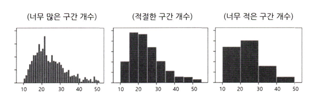
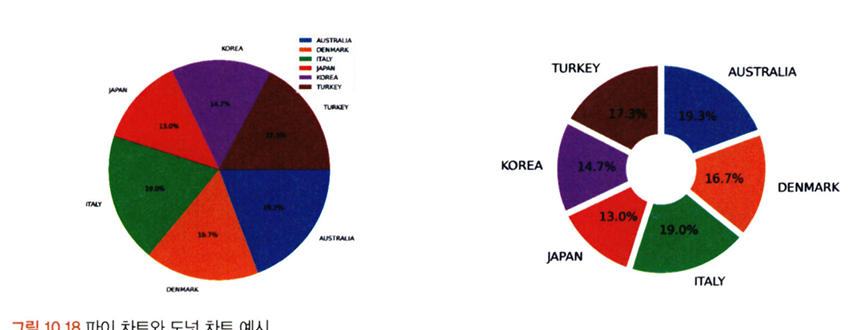
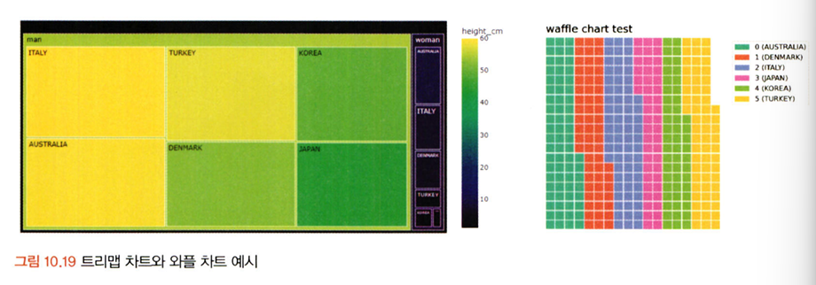
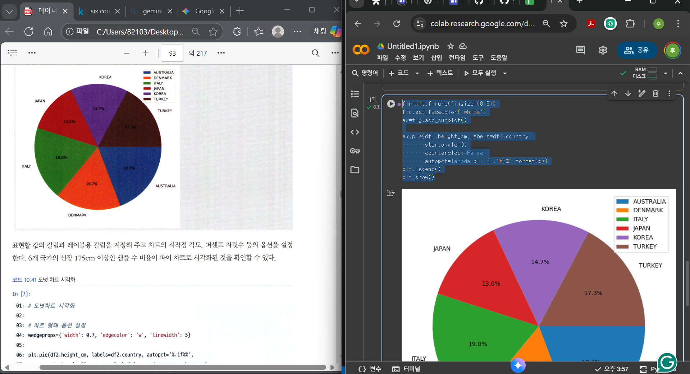

# 통계학 5주차 정규과제

📌통계학 정규과제는 매주 정해진 분량의 『*데이터 분석가가 반드시 알아야 할 모든 것*』 을 읽고 학습하는 것입니다. 이번 주는 아래의 **Statistics_5th_TIL**에 나열된 분량을 읽고 `학습 목표`에 맞게 공부하시면 됩니다.

아래의 문제를 풀어보며 학습 내용을 점검하세요. 문제를 해결하는 과정에서 개념을 스스로 정리하고, 필요한 경우 추가자료와 교재를 다시 참고하여 보완하는 것이 좋습니다.

5주차는 `2부-데이터 분석 준비하기`를 읽고 새롭게 배운 내용을 정리해주시면 됩니다


## Statistics_5th_TIL

### 2부. 데이터 분석 준비하기

### 10. 데이터 탐색과 시각화

- 10.5 분포 시각화부터 10장 마지막 10.8 박스 플롯까지 진행해주시면 됩니다.

**(수행 인증샷은 필수입니다.)** 

<!-- 이번주는 확인 문제가 없고, 교재의 실습에 있는 부분을 따라해주시면 됩니다. 데이터셋과 참고자료는 노션의 정규과제란에 있는 깃허브를 활용해주시면 됩니다. -->

## Study ScheduleStudy Schedule

| 주차  | 공부 범위     | 완료 여부 |
| ----- | ------------- | --------- |
| 1주차 | 1부 p.2~46    | ✅         |
| 2주차 | 1부 p.47~81   | ✅         |
| 3주차 | 2부 p.82~120  | ✅         |
| 4주차 | 2부 p.121~167 | ✅         |
| 5주차 | 2부 p.168~202 | ✅         |
| 6주차 | 3부 p.203~250 | 🍽️         |
| 7주차 | 3부 p.251~299 | 🍽️         |

<!-- 여기까진 그대로 둬 주세요-->

---

# 1️⃣ 개념 정리 

## 10. 데이터 탐색과 시각화

```
✅ 학습 목표 :
* EDA의 목적을 설명할 수 있다.
* 주어진 데이터셋에서 이상치, 누락값, 분포 등을 식별하고 EDA 결과를 바탕으로 데이터셋의 특징을 해석할 수 있다.
* 공분산과 상관계수를 활용하여 두 변수 간의 관계를 해석할 수 있다.
* 적절한 시각화 기법을 선택하여 데이터의 특성을 효과적으로 전달할 수 있다.
```

<!-- 새롭게 배운 내용을 자유롭게 정리해주세요.-->
### 10.5 분포 시각화

분포시각화: 연속형(양적척도), 명목형(질적척도) 구분

1. 연속형(양적척도)
- 막대그래프, 선그래프, 히스토그램 




2. 명목형(질적척도)
- 파이차트, 도넛차트 



- 수치를 함께 표시 
- 트리맵 차트: 구성 요소가 복잡한 질적 척도 표현 
    - 하나의 큰 사각형을 구성 요소 비율에 따라 작은 사각형으로 쪼개어 분포 표현
    - 위계구조 표현 가능
    - ex) 바지(긴 바지 + 반바지)
    - 단점: 구성 요소들 간의 규모차이 大 -> 표현 어려움 
- 와플 차트: 와플처럼 일정한 네모난 조각들로 분포 표현




**패키지 설치 및 임포트**

```
!pip install plotly
!pip install pywaffle # 와플 차트를 만들기 위한 라이브러리 

import matplotlib.pyplot as plt
import pandas as pd
import seaborn as sns
import numpy as np
import plotly.express as px # 웹 기반 시각화를 빠르고 쉽게 생성하기 위한 라이브러리 
from pywaffle import Waffle

```

**전체 신장 데이터 히스토그램 시각화**

```
df1 = df[['height_cm']] #신장 칼럼만 필터링

plt.hist(df1, bins=10,label='bins=10') #10cm 단위로 히스토그램 시각화
plt.legend()
plt.show()

```

**성별을 구분하여 히스토그램 시각화**

```
df1_1 = df[df['sex'].isin(['man'])]#df에서 sex컬럼의 값이 man인 행들만 필터링하여 새로운 df1_1을 생성
df1_1 = df1_1[['height_cm']]#man인 컬럼 중에 height_cm컬럼만 선택하여 df1_1을 재정의 
df1_2 = df[df['sex'].isin(['woman'])]
df1_2 = df1_2[['height_cm']]

plt.hist(df1_1,color='green',alpha=0.2,label='Man', bins=10,density=True)

plt.hist(df1_2,color='red',alpha=0.2, bins=10,label='WOMAN',density=True)
plt.legend()
plt.show()
```

alpha=0.2 (막대의 투명도를 20%로 설정하여 두 히스토그램이 겹쳐도 아래쪽 막대가 보이도록)
label='MAN' (범례에 표시될 레이블을 MAN으로 지정)
density = True (막대의 높이를 빈도 대신 확률밀도로 정규화)
 -> 이게 없으면(density=False) 데이터의 개수(빈도)로 출력됨 density=True는 다른 크기의 데이터셋을 비교, 확률분포 모양을 확인하는데 유용


 **파이차트와 도넛차트 시각화를 위한 데이터 전처리**

 ```
 df2=df[['country','height_cm']]

df2=df2[df.height_cm>=175]
df2=df2.groupby('country').count().reset_index()

df2.head(10)
```

groupby('country'): 현재 df2 dataframe을 'country'컬럼을 기준으로 그룹을 나눔
.count(): 각 그룹(나라) 내에서 데이터 포인트의 개수를 계산
.reset_index(): groupby작업의 결과로 'country'가 인덱스가 되는데, 이를 일반 컬럼으로 되돌립니다 
    -> country를 인덱스가 아닌 일반 컬럼으로 만들어야만 나중에 이 컬럼을 기준으로 다시 필터링하거나 정렬 또는 다른 그룹화 작업을 할 때 더 직관적이고 쉽게 코드를 작성할 수 있음 


**파이차트 시각화**
```
fig=plt.figure(figsize=(8,8)) #캔버스 생성
fig.set_facecolor('white') #캔버스 배경색 설정
ax=fig.add_subplot() #프레임 생성


ax.pie(df2.height_cm,
        labels=df2.country, #각 파이 조각에 
       startangle=0, #시작점 degree 설정
       counterclock=False, #시계방향
       autopct=lambda p: '{:.1f}%'.format(p))
plt.legend()
plt.show()
```
df2.height_cm: 파이조각의 크기를 결정하는 데이터

labels=df2.country: 각 파이 조각에 해당하는 레이블로 사용될 데이터 

startangle=0, #시작점 degree 설정

counterclock=False, #시계방향

autopct=lambda p: '{:.1f}%'.format(p): 각 조각 내부에 표시되 비율 텍스의 형식을 지정(소수점 첫째자리까지 보여줌)

#### 10.5.1 분포 시각화 실습


<br>
<br>

---

# 2️⃣ 확인 과제

> **교재에 있는 실습 파트를 직접 따라 해보세요. 실습을 완료한 뒤, 결과화면(캡처 또는 코드 결과)을 첨부하여 인증해 주세요.단순 이론 암기보다, 직접 손으로 따라해보면서 실습해 보는 것이 가장 확실한 학습 방법입니다.**
>
> > **인증 예시 : 통계 프로그램 결과, 시각화 이미지 캡처 등**



~~~
인증 이미지가 없으면 과제 수행으로 인정되지 않습니다.
~~~


### 🎉 수고하셨습니다.