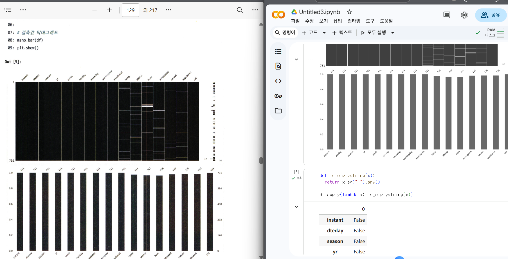

# 통계학 6주차 정규과제

📌통계학 정규과제는 매주 정해진 분량의 『*데이터 분석가가 반드시 알아야 할 모든 것*』 을 읽고 학습하는 것입니다. 이번 주는 아래의 **Statistics_6th_TIL**에 나열된 분량을 읽고 `학습 목표`에 맞게 공부하시면 됩니다.

아래의 문제를 풀어보며 학습 내용을 점검하세요. 문제를 해결하는 과정에서 개념을 스스로 정리하고, 필요한 경우 추가자료와 교재를 다시 참고하여 보완하는 것이 좋습니다.

6주차는 `2부-데이터 분석 준비하기`를 읽고 새롭게 배운 내용을 정리해주시면 됩니다


## Statistics_6th_TIL

### 2부. 데이터 분석 준비하기

### 11. 데이터 전처리와 파생변수 생성

<!-- 11. 데이터 전처리와 파생변수 생성에서 11.1 결측값 처리부터 11.4 데이터 표준화와 정규화 스케일링 파트까지 진행해주시면 됩니다. -->

## Study ScheduleStudy Schedule

| 주차  | 공부 범위     | 완료 여부 |
| ----- | ------------- | --------- |
| 1주차 | 1부 p.2~46    | ✅         |
| 2주차 | 1부 p.47~81   | ✅         |
| 3주차 | 2부 p.82~120  | ✅         |
| 4주차 | 2부 p.121~167 | ✅         |
| 5주차 | 2부 p.168~202 | ✅         |
| 6주차 | 2부 p.203~250 | ✅         |
| 7주차 | 2부 p.251~299 | 🍽️         |

> 과제가 많이 남지 않았습니다. 조금만 더 화이팅해주세요!

<!-- 여기까진 그대로 둬 주세요-->


---

# 1️⃣ 개념 정리 

## 11.데이터 전처리와 파생변수 생성

```
✅ 학습 목표 :
* 결측값과 이상치를 식별하고 적절한 방법으로 처리할 수 있다.
* 데이터 변환과 가공 기법을 학습하고 활용할 수 있다.
* 모델 성능 향상을 위한 파생 변수를 생성하고 활용할 수 있다.
```

### 11.1. 결측값 처리

**결측치 발생 종류**

1. 완전 무작위 결측
    - 결측값이 무작위로 발생한 경우 
    - 결측치가 나타난 데이터 자체를 제거 
2. 무작위 결측
    - 다른 변수의 특성에 의해 해당 변수의 결측치가 체계적으로 발생한 경우
    - ex) A마트의 전국 체인 매출 정보 중, 특정 체인점의 오류로 매출 정보에 결측값이 많이 나타난 경우 

3. 비무작위 결측
    - 결측값들이 해당 변수 자체의 특성을 갖고 있는 경우 
    - ex) A마트 고객정보 데이터에서 개인정보 공개를 선호하지 않아서 결측이 발생한 경우


**결측값 처리 방법**

1. 표본 제거 방법
    - 가장 간단한 방법
    - 결측값이 심하게 많은 변수 제거
    - 전체 데이터에서 결측값 비율 10%미만

2. 평균 대치법
    - 결측값을 제외한 온전한 값들의 평균을 결측값들에 대치
    - 장점: 사용 간단 + 결측 표본 제거 방법의 단점 보완
    - 단점: 통계량의 표준오차가 축소되어 왜곡됨

3. 보간법
    - 시계열적 특성을 가지고 있는 데이터 
    - ex) 매출 데이터의 일별 판매금액 변수의 결측값을 대치하고자 하는 경우 -> 전 시점 or 다음 시점 값, 평균값으로 대치 가능 

4. 회귀대치법
    - 해당 변수와 다른 변수 사이의 관계성을 고려하여 결측값 계산
    - ex) 연령 변수의 결측값 -> 연 수입 변수 사용 
    - 추정하고자 하는 결측값을 가진 변수: 종속변수 / 나머지 변수: 독립변수 
    - 결측된 변수의 분산을 과소 추정하는 단점
    -> 4-1. 확률적 회귀대치법
        - 인위적으로 회귀식에 확률 오차항을 추가
        - 관측된 값들을 변동성만큼 결측값에도 같은 변동성 추가 

5. 다중 대치법
    - 단순대치 여러 번 수행 -> n개의 가상적 데이터 생성 이들의 평균으로 결측값을 대치하는 방법

     **1단계 대치단계**: 가능한 대치 값의 분포에서 추출된 서로 다른 값으로 결측치를 처리한 n개의 데이터셋 생성

     **2단계 분석단계**: 생성된 각각의 데이터셋을 분석하여 모수의 추정치와 표준오차 계산

     **3단계 결합단계**: 계산된 각 데이터셋의 추정치와 표준오차를 결합하여 최종 결측 대치값 산출


#### **결측값 처리 실습**

1. NaN, None이 아닌 빈칸(빈 문자열인 값)으로 되어있는 결측값이 있을 수 있음

```
def is_emptystring(x):
  return x.eq(" ").any()

df.apply(lambda x: is_emptystring(x))
```

2. dropna()함수

```
#모든 컬럼이 결측값인 행 제거
df_drop_all=df.dropna(how="all")

#세 개 이상의 컬럼이 결측값인 행 제거
df_drop_3=df.dropna(thresh=3)

#특정 컬럼(temp)가 결측값인 행 제거
df_drop_slt=df.dropna(subset=["temp"])

#한 컬럼이라도 결측치가 있는 행 제거 
df_drop_any=df.dropna(how="any")
```


### 11.2. 이상치 처리

<!-- 새롭게 배운 내용을 자유롭게 정리해주세요. -->

### 11.3. 변수 구간화

<!-- 새롭게 배운 내용을 자유롭게 정리해주세요. -->

### 11.4. 데이터 표준화와 정규화 스케일링

<!-- 새롭게 배운 내용을 자유롭게 정리해주세요. -->


<br>
<br>

---

# 2️⃣ 확인 과제

> **교재에 있는 실습 파트를 직접 따라 해보세요. 실습을 완료한 뒤, 결과화면(캡처 또는 코드 결과)을 첨부하여 인증해 주세요.**
>
> **단순 이론 암기보다, 직접 손으로 따라해보면서 실습해 보는 것이 가장 확실한 학습 방법입니다.**
>
> > **인증 예시 : 통계 프로그램 결과, 시각화 이미지 캡처 등**



~~~
인증 이미지가 없으면 과제 수행으로 인정되지 않습니다.
~~~


### 🎉 수고하셨습니다.