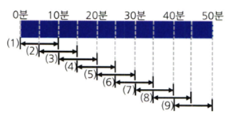
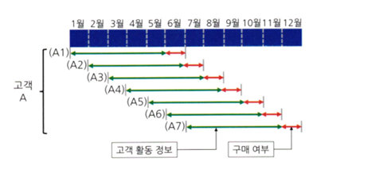
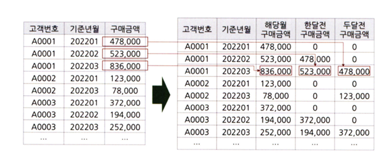
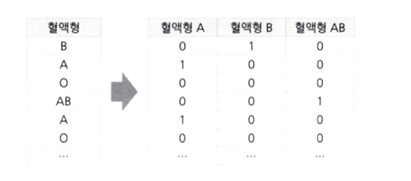
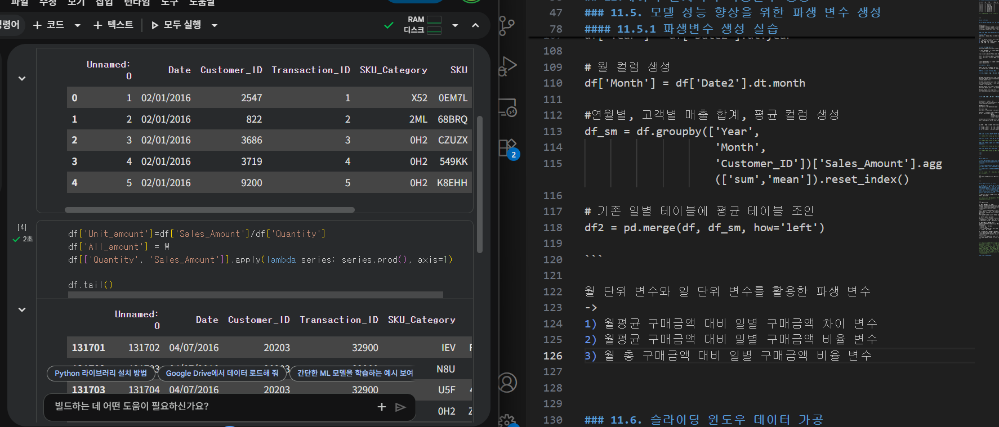

# 통계학 7주차 정규과제

📌통계학 정규과제는 매주 정해진 분량의 『*데이터 분석가가 반드시 알아야 할 모든 것*』 을 읽고 학습하는 것입니다. 이번 주는 아래의 **Statistics_7th_TIL**에 나열된 분량을 읽고 `학습 목표`에 맞게 공부하시면 됩니다.

아래의 문제를 풀어보며 학습 내용을 점검하세요. 문제를 해결하는 과정에서 개념을 스스로 정리하고, 필요한 경우 추가자료와 교재를 다시 참고하여 보완하는 것이 좋습니다.

7주차는 `2부-데이터 분석 준비하기`를 읽고 새롭게 배운 내용을 정리해주시면 됩니다


## Statistics_7th_TIL

### 2부. 데이터 분석 준비하기

### 11. 데이터 전처리와 파생변수 생성

<!-- 11.5 모델 성능 향상을 위한 파 변수 생성부터 11장 끝까지 진행해주시면 됩니다.-->

## Study ScheduleStudy Schedule

| 주차  | 공부 범위     | 완료 여부 |
| ----- | ------------- | --------- |
| 1주차 | 1부 p.2~46    | ✅         |
| 2주차 | 1부 p.47~81   | ✅         |
| 3주차 | 2부 p.82~120  | ✅         |
| 4주차 | 2부 p.121~167 | ✅         |
| 5주차 | 2부 p.168~202 | ✅         |
| 6주차 | 2부 p.203~250 | ✅         |
| 7주차 | 2부 p.251~299 | ✅         |

<!-- 여기까진 그대로 둬 주세요-->


---

# 1️⃣ 개념 정리 

## 11.데이터 전처리와 파생변수 생성

```
✅ 학습 목표 :
* 결측값과 이상치를 식별하고 적절한 방법으로 처리할 수 있다.
* 데이터 변환과 가공 기법을 학습하고 활용할 수 있다.
* 모델 성능 향상을 위한 파생 변수를 생성하고 활용할 수 있다.
```

### 11.5. 모델 성능 향상을 위한 파생 변수 생성

**파생변수**
원래 있던 변수들을 조합 or 함수 적용 후 새로 만들어낸 변수

ex) 
1. 날짜 데이터 -> 요일 변수 , 주말 여부 변수
2. 구간화,표준화, 정규화
3. 기존 값에 로그, 제곱을 취함(변동성 완화 or 분산 증폭)
4. 과거 시점 대비 변화 정도


**<파생변수 생성 목적>**
데이터의 특성을 이용해 분석 효율을 높이는 것 

-> 전체 데이터에 대한 파악이 매우 중요 and 비즈니스 도메인에 대한 충분한 이해 요구 

*ex) 온라인 쇼핑물의 판매량 예측 모델*

기존 변수: 기존 방문 횟수, 클릭 횟수 
파생 변수: 전주 대비 방문 횟수 증감률, 전년도 대비 클릭 횟수 증감률 


충분한 데이터 탐색 및 시각화 -> 데이터의 특성과 흐름 파악 후 파생변수 아이디어 

**<주의해야할 점>**

기존 변수 활용 -> 다중공선성 문제 
상관분석을 통해 변수 간의 상관성을 확인해야함 

#### 11.5.1 파생변수 생성 실습 

**<로그, 제곱근, 제곱 변환 파생변수 생성>**


```
# 방법1.Sales_Amount 컬럼 로그 적용(+1)
df['Sales_Amount_log'] = preprocessing.scale(np.log(df['Sales_Amount']+1))

# 방법2.Sales_Amount 컬럼 로그 적용(+1)
df['Sales_Amount_log2'] = df[['Sales_Amount']].apply(lambda x: np.log(x+1))

# Sales_Amount 컬럼 제곱근 적용(+1)
df['Sales_Amount_sqrt'] = np.sqrt(df['Sales_Amount']+1)

# Sales_Amount 컬럼 제곱 적용
df['Sales_Amount_pow'] = pow(df[['Sales_Amount']],2)

```


**<월 합계, 평균 구매 금액 변수 생성>**

```

# date 컬럼 날짜형식 변환
df['Date2'] = pd.to_datetime(df['Date'], infer_datetime_format=True)

# 연도 컬럼 생성
df['Year'] = df['Date2'].dt.year

# 월 컬럼 생성
df['Month'] = df['Date2'].dt.month

#연월별, 고객별 매출 합계, 평균 컬럼 생성
df_sm = df.groupby(['Year',
                    'Month',
                    'Customer_ID'])['Sales_Amount'].agg(['sum','mean']).reset_index()

# 기존 일별 테이블에 평균 테이블 조인
df2 = pd.merge(df, df_sm, how='left')

```

월 단위 변수와 일 단위 변수를 활용한 파생 변수 
-> 
1) 월평균 구매금액 대비 일별 구매금액 차이 변수
2) 월평균 구매금액 대비 일별 구매금액 비율 변수
3) 월 총 구매금액 대비 일별 구매금액 비율 변수

구매금액 수준이 평소에 비해 얼마나 높거나 낮아졌는지 알 수 있음


**<전월 값을 활용한 파생 변수 생성>**
1. 기존 시점을 한 달 뒤 시점으로 변환
2. sales_amount의 합계, 평균을 구함
3. 기존 한달 전 시점 컬럼을 기준으로 조인 
4. 전 달의 값이 없는 경우 결측값 처리 


**<전월과의 차이 파생변수 생성>**
기준 시점과 한 달 전 시점 간의 차이를 계산하면 고객의 성향이 어떻게 변했는지 판단할 수 있는 변수 생성 가능 

이탈, 우수고객 예측에 사용될 수 있음 


### 11.6. 슬라이딩 윈도우 데이터 가공

슬라이딩 윈도우
: 현재 시점으로부터 +-M기간의 데이터를 일정 간격의 시간마다 전송하는 방식

**how?**

- 데이터 조각들이 서로 겹치며 데이터 전송
- ex) 총 50분의 시간 -> 5분씩 중첩되도록 조각을 내어 9조각 생성



**why?**

- 패킷의 전송을 확인받지 않고도 곧바로 다음 패킷을 보낼 수 있음 -> 효율적
- 데이터를 겹쳐 나눔 -> 전체 데이터가 증가하는 원리 


**where?**

- 슬라이딩 윈도우 데이터 가공 -> 예측 모델


**example**

 인터넷 쇼핑몰: 고객의 지난 5개월 간의 구매내역, 방문횟수 등의 데이터 활용 -> 한 달간의 재구매 확률을 구하는 모델 구축 

 - 1년치 데이터 -> 6개월: train / 6개월: test
 - but 데이터 충분x + 학습데이터 시기 - 예측 데이터 시기 시점 차이大 -> 예측력 떨어짐

 -> 슬라이딩 윈도우 방법 활용

 자료 뻥튀기 가능
 

? 어차피 같은 데이터 아님? 시기를 다르게 한다고 해서 그게 다른 데이터가 됨? 

ㅇㅇ 다른 데이터로 간주 
동일한 사람이라도 1월 ~ 5월 활동 정보, 2월 ~ 6월 활동 정보 다름 (5개월 동안의 구매내역, 방문횟수 등의 차이)




### 슬라이딩 윈도우 데이터 실습

```
# 슬라이딩 윈도우 형태로 변환

m_col = ["M{}".format(i) for i in range(6)]  # M0~M5 목록 생성
df_li = []  # 임시 테이블 저장할 목록

for n, ym in enumerate(ym_li):  # YM_M0~YM_M5 반복
    # STD_YM_M0 변수 기준 M0~M5 & 구매금액 0원 초과
    tmp = df_raw[(df_raw[ym].isin(m_col)) & (df_raw['sale_amt'] > 0)]
    
    # YM_M0 기준 pivot
    tmp = tmp.pivot_table(index='cust_id',
                          columns=ym, values='sale_amt',
                          aggfunc='sum')

    # M0~M12 중 누락된 컬럼 생성
    # # 추후 테이블 union을 위해 pivot 시 누락된 컬럼을 별도로 생성
    missing_col = list(set(m_col) - set(tmp.columns))
    for col in missing_col:
        tmp[col] = 0

    # 컬럼 이름 변경
    tmp.columns = [f'slae_amt_{c}' for c in tmp.columns] # 생략 가능

```


### 11.7. 범주형 변수의 가변수 처리

더미변수(가변수) 처리 : 범주형 변수를 0과 1의 값을 가지는 변수로 변환 -> 이진변수(=불리언 변수)

모델은 범주형 데이터를 인지할 수 없음 

남자 = 0 여자 = 1로 변환

원핫, 라벨 인코딩과 유사 !

**범주의 개수보다 하나 적게 가변수를 만들어줌**



그림처럼 어느 변수에도 속하지 않는 O형이 있기 때문에 

종속변수에 대한 영향력이 가장 적은 범주를 가변수 후보에서 제거 

제거된 범주: baseline 

baseline범주를 기반으로 각각 범주들의 종속변수에 대한 영향력 산출 

**다중공선성**
if)  A, B, AB, O 모두 가변수로 만들어줬다면

A=0, B=0, AB=0이라면 O는 무조건 1

A B AB 가 O형 가변수에 영향을 준다는 의미 

다중공선성 문제가 있음 


### 범주형 변수의 가변수 처리 실습


#### get_dummies

```
df1= pd.get_dummies(df)
```
문자형 변수를 모두 가변수 처리하는 함수

문제: id도 가변수 처리함


```
df= pd.get_dummies(df,columns=['Compute Type','OS'],drop_first=True,dummy_na=True)

```

특정 컬럼만 가변수 처리 + 첫 번째 범주를 제거(drop_first=True) + 결측값을 별도의 컬럼으로 처리(dummy_na=True)

왜냐면 결측값 자체에도 의미가 있을 수 있음 (아웃풋: '_nan'접미사가 붙은 컬럼 생성)


### 11.8. 클래스 불균형 문제 해결을 위한 언더샘플링과 오버샘플링

클래스 불균형: 이진분류 모델에서 특정 값(0 or 1)의 비율이 매우 적음 


**클래스 불균형의 문제**

- 학습이 제대로 이루어지지 않음

- 예측 정확도가 떨어짐

- 일반적으로 ML 분류 모델은 적은 비중의 클래스 든 중요도에 차별을 두지 않고 전체적으로 분류를 잘하도록 학습

- BUT 대게 우리가 알고 싶은 정보는 적은 비중의 클래스( ex) 암진단시 극소수의 실제 암에 걸린 사람, 불법 사용자 탐색)


*예시*

<A 분류 모델> 

90% 비중의 class, 80% 정확하게 분류

10% 비중의 class, 100% 정확하게 분류

모델 정확도: 0.9*0.8 + 0.1*1.0 = 82%

<B 분류 모델> 

90% 비중의 class, 90% 정확하게 분류

10% 비중의 class, 50% 정확하게 분류

모델 정확도: 0.9*0.9 + 0.1*0.5= 86%


모델 정확도는 B분류 모델이 더 높지만, 10% 소수의 클래스를 정확하게 분류하는 A분류 모델을 채택할 것임

BUT 기계학습 모델은 모델 정확도가 더 놓은 B분류 모델과 같은 모델을 만들 것임 


**데이터 불균형 문제 해결 방법**

**1. 가중치 밸런싱**

모델 자체에 중요도가 높은 클래스에 정확도 가중치, 특정 클래스의 분류 정확도가 높아지도록 조정해줌

높은 모델 정확도 = 잘못 분류한 비중을 최소화 = 분류 예측에 따른 손실 최소화 

가중치 밸런싱 -> 중요도가 높은 클래스(비중이 낮은 클래스)를 잘못 분류하면 더 큰 손실을 계산하도록 조정

ex) 

10% 비중의 클래스 : 90%의 손실 가중치
90% 비중의 클래스: 10%의 손실 가중치  


**2. 언더샘플링과 오버샘플링**

불균형 데이터 자체를 균형이 맞도록 가공 후 모델 학습

**1) 언더샘플링**

큰 비중의 클래스의 데이터를 작은 비중의 클래스 데이터만큼만 추출하여 학습

- 랜덤 언더샘플링: 무작위로 제거
- EasuEnsemble: 

**2) 오버샘플링**

언더샘플링과 반대, 데이터 뻥튀기


### 11.9. 데이터 거리 측정 방법

<!-- 새롭게 배운 내용을 자유롭게 정리해주세요. -->

<br>
<br>

---

# 2️⃣ 확인 과제

> **교재에 있는 실습 파트를 직접 따라 해보세요. 실습을 완료한 뒤, 결과화면(캡처 또는 코드 결과)을 첨부하여 인증해 주세요.**
>
> **단순 이론 암기보다, 직접 손으로 따라해보면서 실습해 보는 것이 가장 확실한 학습 방법입니다.**
>
> > **인증 예시 : 통계 프로그램 결과, 시각화 이미지 캡처 등**



~~~
인증 이미지가 없으면 과제 수행으로 인정되지 않습니다.
~~~


---

# 3️⃣ 실습 과제 (마지막 과제)

>  **🧚Q. 마지막 과제는 다음과 같습니다. 『데이터 분석가가 반드시 알아야 할 모든 것』 2부를 마무리하는 주차로,그동안 배운 데이터 전처리 및 파생변수 생성 내용을 실제 데이터에 적용해 보는 실습형 과제입니다. 단순히 함수를 실행하는 데서 그치지 않고, "왜 이 전처리 방법을 선택했는가" 와 "데이터가 말해주는 인사이트는 무엇인가'를 중심으로 EDA(탐색적 데이터 분석)를 함께 수행해주세요.**
>
> (정규과제 업로드 시트에 과제를 수행한 Git 링크와 코랩도 같이 올려주세요) 

<!-- 4주차 과제부터 실습하면서 배운 파이썬 문법을 적용하면서 실습을 진행해주세요 -->

~~~
과제 가이드라인

1. 실습 데이터셋 불러오기
Kaggle : Students Performance in Exams
- 출처: https://www.kaggle.com/datasets/spscientist/students-performance-in-exams
- 설명:
미국 고등학생 1000명의 성적과 배경 요인(성별, 인종, 부모 학력, 점심 여부, 시험 준비 과정 등)을 담은 데이터입니다.
math score, reading score, writing score 3가지 점수를 기준으로
학업 성취에 영향을 미치는 요인을 분석해볼 수 있습니다.

2. 데이터 전처리 진행하기
교재에서 배웠던 개념들을 적용해면서 전처리를 진행해봅시다. 
- 결측값 처리, 이상치 처리, 스케일링 등 
- (Optional) 범주형 변수 인코딩, 파생 변수 생성

3. EDA (탐색적 데이터 분석)
전처리된 데이터를 바탕으로 자유롭게 시각화 및 요약 분석을 수행하세요. 
- 점수 간 상관관계 분석
- 그룹 별 비교
- 여러 과정에 따른 성적 분포 비교
- 변수 간 관계 시각화 

4. 주석이나 코드 설명에서 들어가야 할 부분
- 교재에 있는 어떤 통계 개념을 적용했는지
- 각 개념이 데이터 분석에서 어떻게 활용되었는지를 스스로 설명해보세요.
- 단순한 코드 작성보다, 통계 개념 -> 코드 적용 -> 해석 -> 배운 점의 흐름을 명확히 드러내는 것이 핵심 기준입니다. 
~~~


<!-- 이것으로 통계학 정규과제가 마무리 되었습니다.  자료실에서 보면 아시겠지만, 이번 통계학 정규과제는 2부까지만 진행을 하였습니다. 3부부터는 모델에 대한 개념이 등장하기 때문에, 수학적 통계학을 배우고 분석의 기초를 다지는 부분에 여러분이 더 집중할 수 있도록 구성했습니다. 또한 전체 분량이 길기 때문에 학습 부담을 줄이기 위한 결정입니다. 따라서 이번 주차를 끝으로 정규 과제는 마무리되지만, 머신러닝 모델에 대해 더 깊이 공부하고 싶은 분들은 3부를 개인적으로 학습해보는 것을 추천드립니다. 그동안 과제를 열심히 하느라 고생하셨습니다. -->

### 🎉 수고하셨습니다.